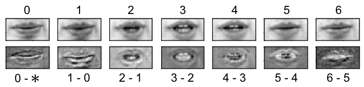
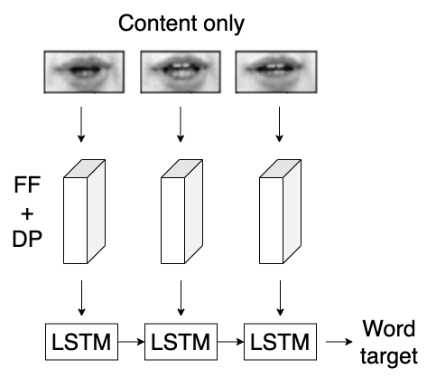
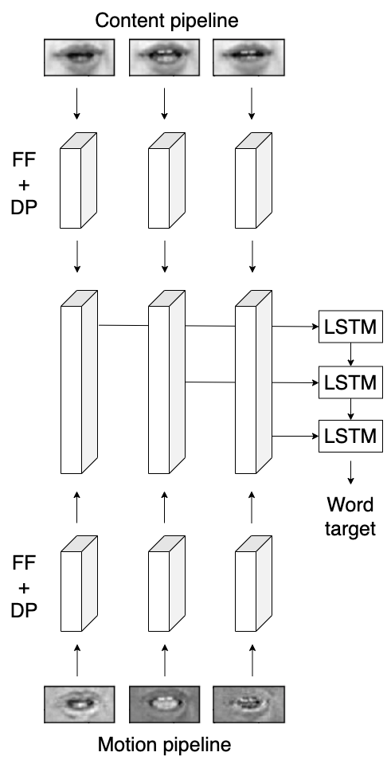
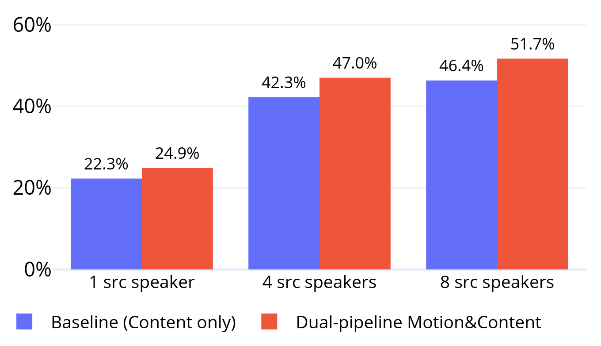

# Speaker-independent Lipreading

This is the **code repository** for the work published in

[Matteo Riva, Michael Wand, and Jürgen Schmidhuber](https://ieeexplore.ieee.org/document/9053535). *Motion dynamics improve speaker-independent lipreading.* In Proc. ICASSP, 2020, pp. 4407-4411.

|  |
|:-------:|
| Example of content and motion frames |

## Abstract

We present a novel lipreading system that improves on the task of speaker-independent word recognition by decoupling motion and content dynamics. We achieve this by implementing a deep learning architecture that uses two distinct pipelines to process motion and content and subsequently merges them, implementing an end-to-end trainable system that performs fusion of independently learned representations. We obtain a average relative word accuracy improvement of ≈ 6.8% on unseen speakers and of ≈ 3.3% on known speakers, with respect to a baseline which uses a standard architecture.

## Model

We implement two distinct pipelines that follow the same architecture as the baseline, excluding the final LSTM layer. One takes content frames as input and one takes the motion ones. The hidden representations learned by these are concatenated into a single joint representation used as input to a final LSTM layer, providing a end-to-end trainable system that implements the fusion of separately processed input sequences.

|  |  |
|:-------:|:-------:|
| Baseline architecture | Dual pipeline Motion-Content |

## Results

